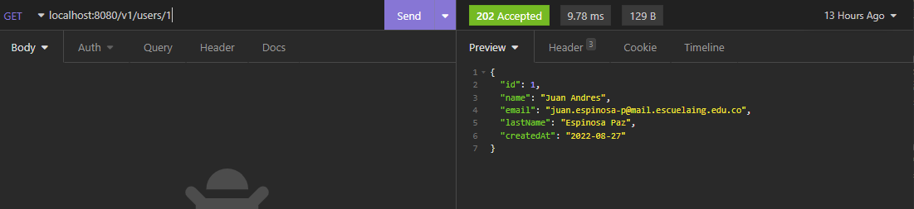

# lab01IETI

## Micro User
### Create User

### Get User

### Get All Users
* it has two more users for test

### Update User

***get User 1 to see changes***

### Delete User

***get users after delete***

## Autores ✒️

* **Juan Pablo Espinosa Tovar**
